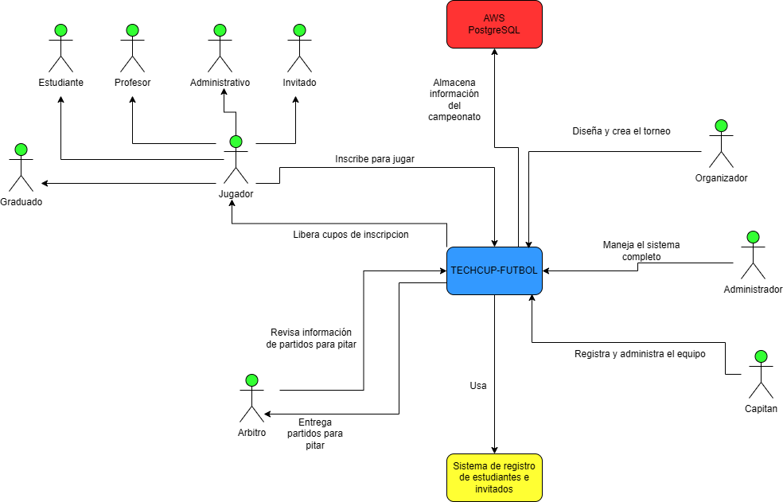
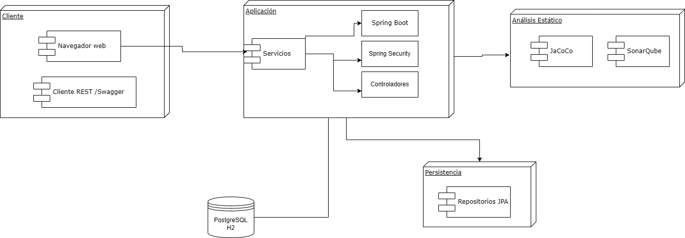
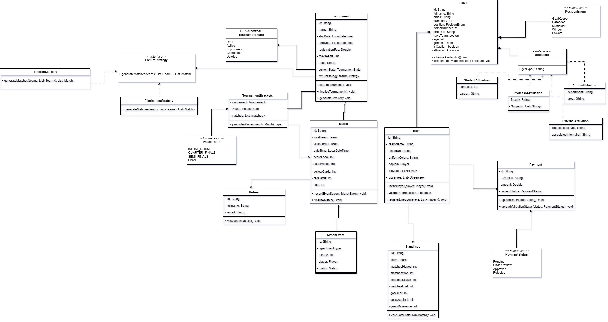
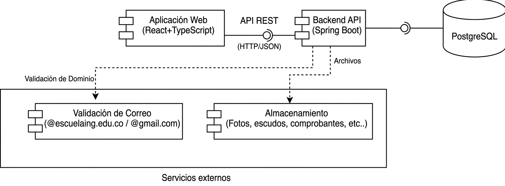
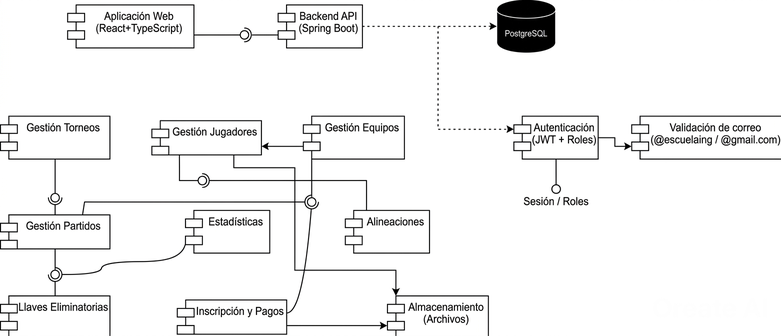
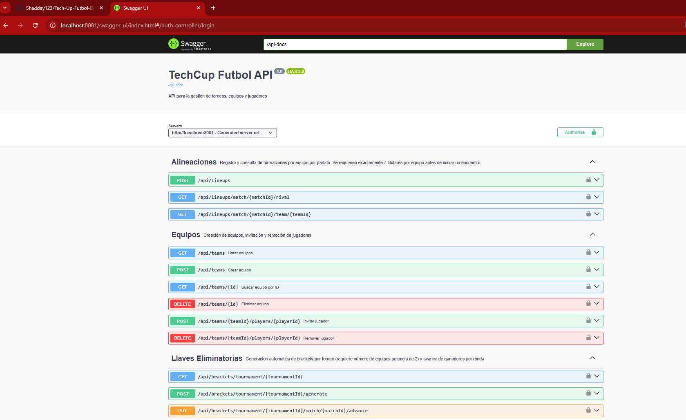
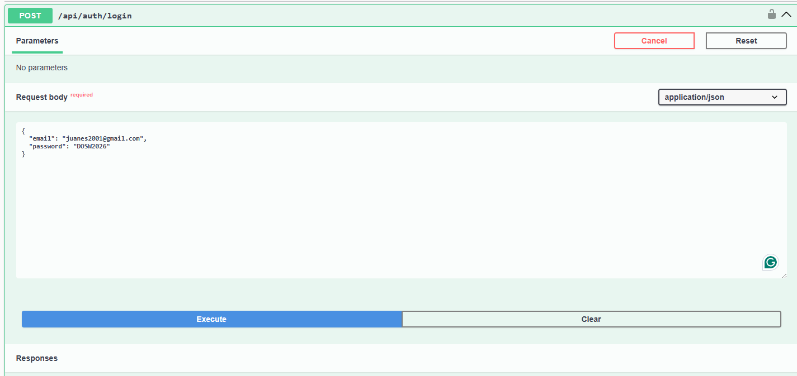
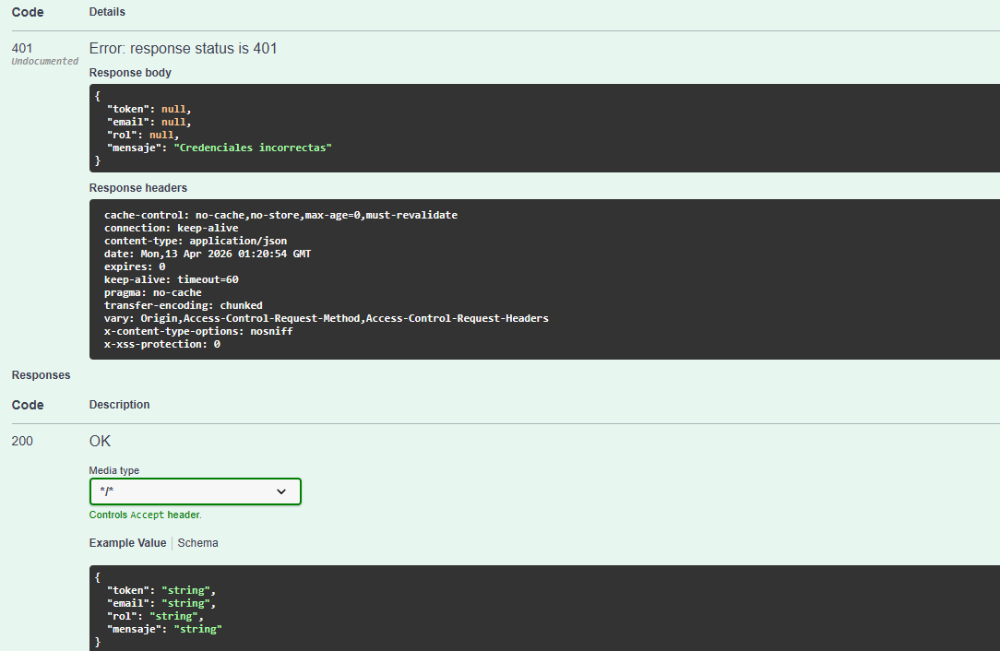

# Tech-Up-Futbol-BackEnd (Los Asgardianos)

## Objetivo del proyecto
Desarrollar una plataforma web para la gestión del torneo semestral a cargo del programa de Ingeniería de Sistemas de la Escuela Colombiana de Ingeniería Julio Garavito, debido a la ausencia actual de un sistema automatizado para el registro y administración de torneos, partidos y jugadores. Esta solución tiene como propósito optimizar la organización de los eventos deportivos, facilitando a los estudiantes la 
creación y gestión de torneos, y reduciendo la carga operativa asociada a procesos manuales.

## Descripción del servicio
El sistema consiste en una plataforma web orientada a la gestión de torneos de fútbol dentro de la Escuela Colombiana de Ingeniería Julio Garavito. El backend del sistema se encarga de procesar la lógica de negocio, gestionar la información y servir como intermediario entre el cliente (frontend) y la base de datos.

## Integrantes 
- Jeimmy Vanessa Torres
- David Shadday Correa
- Juan Esteban Rodríguez
- David Santiago Cajamarca
- Juan Diego Melo

## Diagrama de Contexto


Nuestro sistema central de TECHCUP-FUTBOL se basa en nucleos de gestion de torneos, manejo de usuarios y control de partidos.
El diagrama de contexto usa los siguientes componentes importantes:

- Actores: Estudiantes, Profesores, Admininstrativos, Graduados y demas de la Escuela Colombiana dd Ingenieria Julio Garavito junto con los invitados por parte de miembros de la institución
- Capitán: Miembro de la institución que se encarga de registrar y administrar su propio equipo
- Organizador: Encargado de diseñar y crear los torneos
- Administrador: Controla el sistema TECHCUP en su totalidad
- Arbitro: Consulta solamente los partidos a dirigir y ejecuta su labor de arbitraje
- AWS: PostgreSQL para guardar toda la información del torneo manteniedo la persistencia del sistema
- Sistemas externos: Sistema de registro de jugadores para integración de validaciones por cada uno de ellos

## Tecnologias utilizadas
- Java OpenJDK 21: Lenguaje de programación base 
- Spring Boot: Framework para el desarrollo de aplicaciones web
- Spring Security: Modulo de seguridad para autenticaciones
- Maven: Herramienta de gestión de dependencias
- JUnit 5 : Framework para pruebas unitarias
- Jacoco: Cobertura de código
- SonarQube: Analisis estático de código
- Swagger/OpenAPI: Documentación de API REST
- Lombok: Reducción de código boilerplate

## Analisis de requerimientos
[Requirements (1).md](Requirements%20%281%29.md)

## Análisis de patrónes de diseño
[AnalisisDePatrones.md](AnalisisDePatrones.md)

## Diagrama de Despliegue


## Diagrama de Clase

Este diagrama modela el dominio de nuestra app TECHCUP usando principios de "clean code" y patrónes de diseños.

## Diagrama de Componentes

### General

### Especifico


## Diagrama de Entidad-Relacion (Base de datos)

Este diagrama modela la estructura de datos de TECHCUP basandonse en principios de normalización. Su identidad central de torneos
actua como el eje de dominio, relacionandose con sus configuraciones, pagos, y llaves de eliminatorias. Estas llaves se componen de múltiples 
partidos, donde se almacenan atributos de resultados y métricas de los encuentros, se vinculan con el registro de encuentros. Los equipos agrupa a los jugadores , 
estableciendo relaciones de pertenencia y roles como capitán, mientras que las alineaciones se crean de manera táctica.
En conjunto, el modelo garantiza consistencia en los datos, soporte transacional y una adecuada separación de responsabilidades a nivel de persistencia.

## Documentación API (Swagger)
El proyecto utiliza Swagger para documentar la API REST. Con este link se accede:
[](http://localhost:8081/swagger-ui/index.html)



### Ejemplo de login
Aqui un ejemplo de como usamos nuestra API para logrearnos al TECHCUP

Usamos el endpoint de POST para logearnos y luego se muestra los siguientes errores


El manejo de response se plantea con 200´s y 400´s indicando los de 200 aprobaciones y 400 con rechazos.

Aqui en el siguiente archivo, se puede ver los "Happy path" y "Error path":

[Pruebas.md](Pruebas.md)

## Diagrama de secuencia


## Pipeline CI/CD

El proyecto usa **GitHub Actions** con dos workflows diferenciados:

### Deploy a QA (`develop`)
Se activa en cada push a la rama `develop`.

| Paso | Herramienta | Descripcion |
|------|-------------|-------------|
| Checkout | actions/checkout@v4 | Clona el repositorio |
| Build | Maven `mvn clean package` | Compila y ejecuta tests |
| Cobertura | JaCoCo | Genera reporte HTML y XML en `target/site/jacoco/` |
| Analisis estatico | SonarCloud | Envia metricas de calidad y cobertura a sonarcloud.io |
| Artefacto | actions/upload-artifact@v4 | Guarda el reporte JaCoCo 7 dias |
| Deploy | azure/webapps-deploy@v3 | Despliega el JAR a **techcup-qa** en Azure |

**Secrets requeridos:** `GOOGLE_CLIENT_ID`, `GOOGLE_CLIENT_SECRET`, `AZURE_WEBAPP_PUBLISH_PROFILE_QA`, `SONAR_TOKEN`, `SONAR_PROJECT_KEY`, `SONAR_ORGANIZATION`

### Deploy a Produccion (`main`)
Se activa en cada push a la rama `main`.

| Paso | Herramienta | Descripcion |
|------|-------------|-------------|
| Checkout | actions/checkout@v4 | Clona el repositorio |
| Build | Maven `mvn clean package -DskipTests` | Compila sin ejecutar tests |
| Login ACR | docker/login-action@v3 | Autentica en Azure Container Registry |
| Docker build & push | docker/build-push-action@v5 | Construye imagen y la sube al ACR |
| Deploy | azure/webapps-deploy@v3 | Despliega la imagen Docker a **techcup-prod** (requiere aprobacion manual en GitHub) |

**Secrets requeridos:** `GOOGLE_CLIENT_ID`, `GOOGLE_CLIENT_SECRET`, `ACR_LOGIN_SERVER`, `ACR_USERNAME`, `ACR_PASSWORD`, `AZURE_WEBAPP_PUBLISH_PROFILE_PROD`

### Variables de entorno en Azure (Application Settings)
Ambos entornos deben tener configuradas en Azure Portal:

```
DB_URL, DB_USER, DB_PASS, DB_DRIVER, JPA_DIALECT
JWT_SECRET, JWT_EXPIRATION_MS
GOOGLE_CLIENT_ID, GOOGLE_CLIENT_SECRET
```
